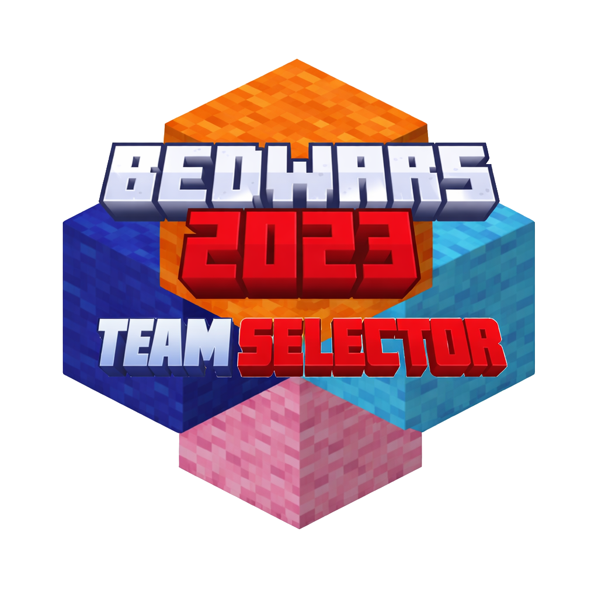
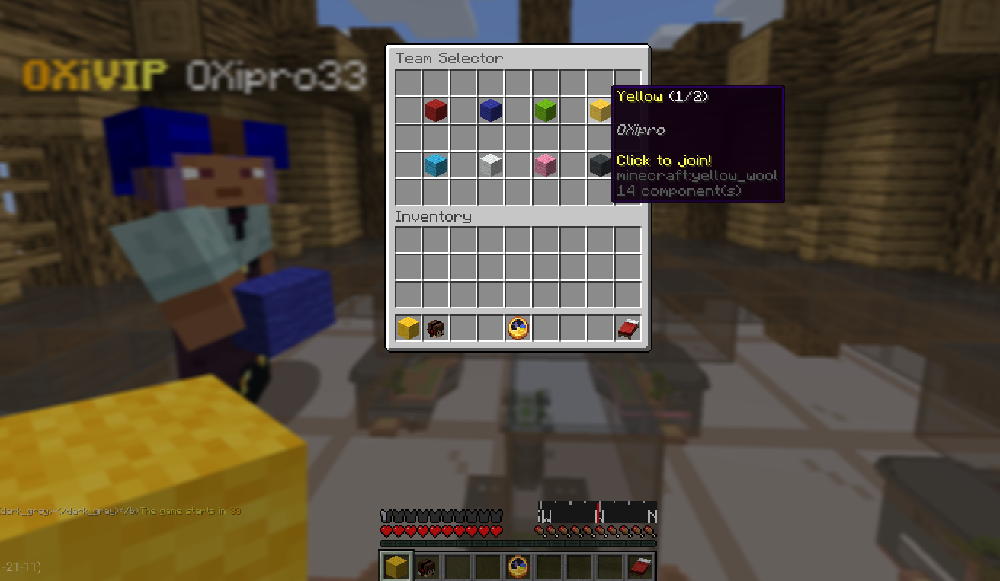

# <p style="text-align: center;"> BedWars2023-TeamSelector</p>
<p style="text-align: center;">   </p>


A **Team Selector add-on** for the **BedWars2023** mini-game.
This plugin allows players to choose their team via a GUI before the game starts, with configurable behavior and full multi-version support.



---

## ✨ Features

* Team selector item given to players
* Selector item color adapts to the selected team
* Optional team-colored helmet
* Allow or deny team changes
* Team size balancing
* Configurable sounds (GUI open, success, error)
* Fully configurable via `config.yml`
* PlaceHolderAPI integration

---

## 🧪 Compatibility

* **Minecraft versions:** `1.13 → 1.21.8` (theoretically)
* **Tested versions:** `1.21.8`
* **Required plugin:** `BedWars2023`

> ⚠️ This plugin is an **add-on** and will not work without BedWars2023.

---
## ⬇️ Download
* You can download this addon from:
  * [The GitHub releases](https://github.com/OXipro/BedWars2023-TeamSelector/releases/latest)
  * [Official BedWars2023 Discord](https://discord.com/channels/760851292826107926/1201961403557363722) In # Official-addons
---
## 📂 Installation

1. Make sure **BedWars2023** is installed and starts properly.
2. Drop `BedWars2023-TeamSelector-VERSION.jar` into your server's plugin folder.
3. Restart your server.
4. The configuration file will be generated at:

   ```
   /plugins/BedWars2023/Addons/TeamSelector/config.yml
   ```
5. You can change all the text messages in the bw2023 langages files:
    ```
   /plugins/BedWars2023/Languages/messages_**LANGUAGE-CODE**.yml
   ```
---

## ⚙️ Configuration

Below is the default `config.yml` with explanations for each option.

```yml
# BedWars2023-TeamSelector configuration

team-helmet: true # The material you want the team-selector item be.
team-selector-item-stack: WHITE_WOOL # Bukkit Material that opens the TeamSelector Menu
team-selector-slot: 0 # The slot where to put the item. Set it to -1 to assign the first empty slot.
give-team-color: true # true if you want to have the selectorTeam Item having the team's color.
allow-team-change: true # true if you want to allow players to change selected team.
allow-move-in-inventory: false # false - true if you want to allow players to move it in inventory.
balance-teams: false # true if you want to have balanced teams size.
gui-open-sound: BLOCK_SHULKER_BOX_OPEN # The sound to be played when you open the team selector.
success-sound: BLOCK_SHULKER_BOX_CLOSE # The sound to be played when you select a team successfully.
error-sound: BLOCK_ANVIL_DESTROY # The sound to be played when you can't select a team.
```
---

## PlaceholderAPI

* This addon adds placeholder to PAPI
* This is useful if you want to display player chosen team in your tab (for example)
* at the moment there are only 2 placeholders:
  * `%bwteamselector_teamcolorcode%` will return bukkit & formatted color codes
  * `%bwteamselector_teamflag%` will return bold ⚑ colored with the selected player team

---

## Issues & Suggestions

If you encounter a bug or have a feature request:

* Open an **Issue** on GitHub
* Provide:

    * Server version
    * BedWars2023 version
    * Config file
    * Error logs (if any)
* Or contact me on discord `oxipro`

---
## Java API

### Maven:
```xml
<dependency>
    <groupId>com.tomkeuper.bedwars</groupId>
    <artifactId>BedWars2023-TeamSelector</artifactId>
    <version>1.0</version>
    <scope>system</scope>
    <systemPath>BedWars2023-TeamSelector-1.0.jar</systemPath>
</dependency>
```
don't forget to replace the systemPath value with the valid path to the addon release in your project

### Use:
```java
private TeamSelectorAPI teamSelectorAPI;

@Override
public void onEnable() {

    RegisteredServiceProvider<TeamSelectorAPI> rsp =
            Bukkit.getServicesManager().getRegistration(TeamSelectorAPI.class);

    if (rsp == null) {
        getLogger().severe("TeamSelector API not found!");
        Bukkit.getPluginManager().disablePlugin(this);
        return;
    }

    teamSelectorAPI = rsp.getProvider();

    getLogger().info("TeamSelector API loaded (v" + teamSelectorAPI.getApiVersion() + ")");

    Bukkit.getServer().getPluginManager().registerEvents(new testlistener(), this);
}
```
For more details go directly to the source.

---

## Authors

* **andrei1058** - Has made the original bw1058 plugin code.
* **batmann4bot/pimentelleo** - Has made the Bedwars 1058 to 2023 port.
* **OXipro** Added some functionality and released it properly. **Discord:** `oxipro`


---

⭐ If you like this add-on, consider starring the repository on GitHub!
